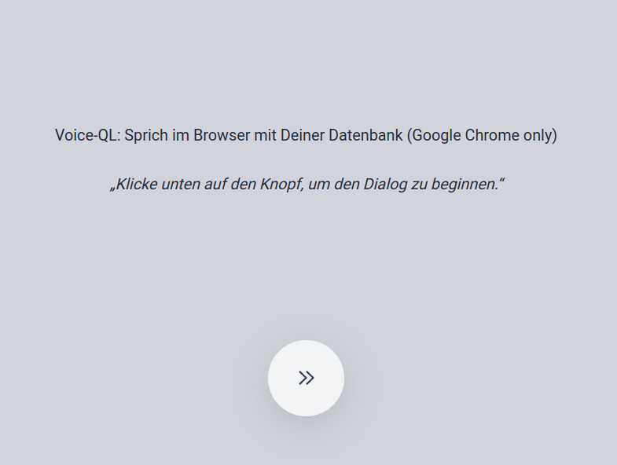

<a href= "https://prototypefund.de/project/voice-ql-datentabellen-mit-gesprochener-sprache-barrierefrei-erkunden/"></a>

# Voice-QL - Web Client - Talking Browser Demo

## Introduction

This code in this repository is part of the ["Voice QL" project](https://github.com/fboerncke/voice-ql) and requires two other services to be up and running when you want to use it (see installation instructions below).

The main setup and architecture has been cloned from the Jovo Web Starter Demo for a "Standalone Voice Experience" in a Chrome browser which can be found here: https://github.com/jovotech/jovo-starter-web-standalone

You can use this Web Client to talk via the microphone from your device with a database using your voice and natural language commands.

## Look and feel

After launch in a browser you can use a button to make your microphone listen to your (German) voice commands which will then be executed by the Voice-QL backend.

The system will read the results allowed. The following screen shot shows you the look and feel:

[](https://www.bmbf.de/)

## Quick setup for test environment

How to setup:

1. **Preparation**: Start **Snips NLU** as described here: https://github.com/fboerncke/voice-ql#setup--installation

2. **Preparation**: Start **Voice-QL** as described here: https://github.com/fboerncke/voice-ql#setup--installation

   The demo will later use (1) and (2) as backend.

3. Now checkout, build and start the demo:

   ```
   mkdir voice-ql-vue-talking-client
   git clone git@github.com:fboerncke/voice-ql-vue-talking-client.git
   npm install
   npm run serve
   ```

4. If you experience problems when launching and see error messsages related to SSL this may be because of a newer node version. The following environment setting should help you in that case:

   ```
   export NODE_OPTIONS=--openssl-legacy-provider
   ```

   Then run `npm run serve` again.

5. Now use your local browser and navigate to the address shown in the console window, e.g. `http://localhost:8080/` and follow the instructions on the screen.

<b>Restrictions</b>: this demo uses the [Web Speech API](https://wicg.github.io/speech-api/), which only works in Google Chrome

## App

You can host your Jovo app on almost any platform, whether you choose a hosting provider or to build your own Node.js-based HTTP server. Here are a few examples:

- [AWS Lambda](https://www.jovo.tech/marketplace/server-lambda)
- [Express](https://www.jovo.tech/marketplace/server-express)

## About Jovo

Jovo is the most popular development framework for voice, including platforms like Alexa, Google Assistant, and the web.

- [Jovo Website](https://jovo.tech/)
- [Documentation](https://jovo.tech/docs/)
- [Marketplace](https://www.jovo.tech/marketplace/)
- [Twitter](https://twitter.com/jovotech/)
- [Forum](https://community.jovo.tech/)

## Acknowledgements

This project receives funding from the [German Federal Ministry of Education and Research](https://www.bmbf.de/) (FKZ 01IS22S30)

[](https://www.bmbf.de/)
&nbsp; &nbsp;
[](https://okfn.de)
&nbsp; &nbsp;
[](https://prototypefund.de/)

The Prototype Fund is a project of the Open Knowledge Foundation Germany, funded by the German Federal Ministry of Education and Research (BMBF).
